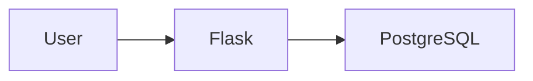

# 🚀 Containerized Flask Application with CI/CD


A containerized Flask application connected to PostgreSQL, featuring automated testing and Continuous Integration using GitHub Actions.

This project was built to gain hands-on experience with modern DevOps workflows, containerization, CI/CD pipelines, database integration, and Linux-based development environments.

---

## 📌 Key Achievements

- Built a multi-container application using Docker Compose
- Connected a Flask application to PostgreSQL
- Implemented persistent database storage using Docker Volumes
- Managed application configuration with Environment Variables
- Created automated tests using Pytest
- Built a CI pipeline using GitHub Actions
- Automated Docker image builds on every push to the main branch
- Practiced troubleshooting and debugging in containerized environments

---

## 🏗 Architecture



---

## 🛠 Tech Stack

| Category | Technology |
|-----------|------------|
| Language | Python |
| Framework | Flask |
| Database | PostgreSQL |
| Containers | Docker |
| Orchestration | Docker Compose |
| CI/CD | GitHub Actions |
| Testing | Pytest |
| Version Control | Git & GitHub |
| Operating System | Ubuntu Linux |

---

## 📂 Project Structure

```text
todo-app/
├── .github/
│   └── workflows/
│       └── ci.yml
├── tests/
│   └── test_app.py
├── app.py
├── Dockerfile
├── docker-compose.yml
├── requirements.txt
├── .env
└── README.md
```

---

## ⚙️ Running Locally

### Clone Repository

```bash
git clone git@github.com:saros-dev/devops-lab.git
cd devops-lab/todo-app
```

### Start Services

```bash
docker compose up -d
```

### Verify Containers

```bash
docker compose ps
```

Expected output:

```text
app    Up
db     Up
```

---

## 🔍 API Endpoints

### Home

```bash
curl localhost:5000
```

Response:

```text
Flask is running
```

---

### Database Check

```bash
curl localhost:5000/db
```

Returns PostgreSQL version information.

---

### Add Todo

```bash
curl localhost:5000/add/test1
```

Response:

```text
added: test1
```

---

### List Todos

```bash
curl localhost:5000/todos
```

Response:

```text
[(1, 'test1')]
```

---

## 🧪 Running Tests

Create and activate a virtual environment:

```bash
python3 -m venv venv
source venv/bin/activate
```

Install dependencies:

```bash
pip install -r requirements.txt
```

Run tests:

```bash
pytest
```

Expected result:

```text
1 passed
```

---

## 🔄 CI Pipeline

Every push to the `main` branch automatically triggers GitHub Actions.

Pipeline workflow:

```text
Push
 ↓
Checkout Code
 ↓
Install Dependencies
 ↓
Run Tests
 ↓
Build Docker Image
 ↓
Success
```

Current pipeline validates:

- Dependency installation
- Automated tests
- Docker image build process

---

## 💾 Persistent Storage

PostgreSQL data is stored using Docker Volumes.

```yaml
volumes:
  - postgres_data:/var/lib/postgresql/data
```

This ensures application data survives container restarts and recreation.

---

## 📚 DevOps Concepts Practiced

- Linux Administration
- SSH Authentication
- Git & GitHub Workflow
- Docker Images
- Docker Networking
- Docker Volumes
- Docker Compose
- Environment Variables
- PostgreSQL Integration
- Automated Testing
- CI/CD Fundamentals
- GitHub Actions
- Troubleshooting Containerized Applications

---

## 🚧 Roadmap

### Completed ✅

- Flask Application
- PostgreSQL Integration
- Docker Containerization
- Docker Compose
- Persistent Volumes
- Environment Variables
- Automated Testing
- GitHub Actions CI

### Planned 🔜

- Docker Hub Integration
- Nginx Reverse Proxy
- HTTPS with Let's Encrypt
- VPS Deployment
- Monitoring & Logging
- Terraform
- Kubernetes Deployment

---

## 👨‍💻 Author

**Saros Shojaei**

Computer Engineer  
DevOps & Cloud Enthusiast

GitHub: @saros-dev
